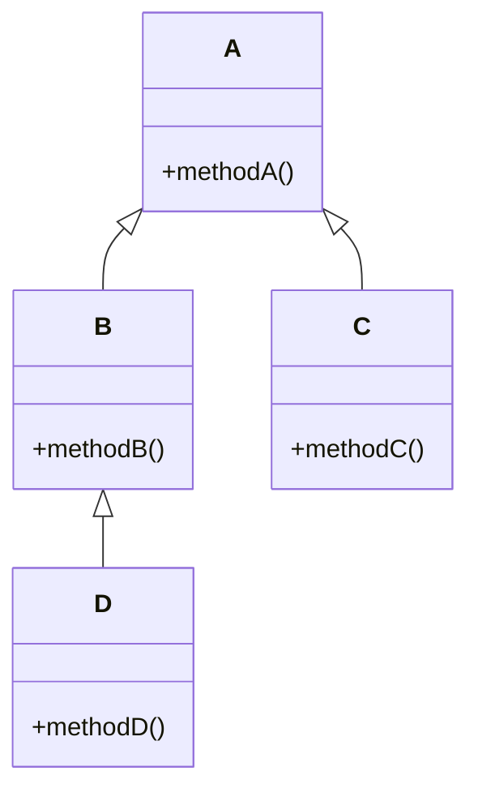

# Mermaid Diagram for Classes and Relationships
Download

```mermaid
classDiagram
    class A {
        +methodA()
    }
    class B {
        +methodB()
    }
    class C {
        +methodC()
    }
    class D {
        +methodD()
    }

    A <|-- B
    A <|-- C
    B <|-- D
```
