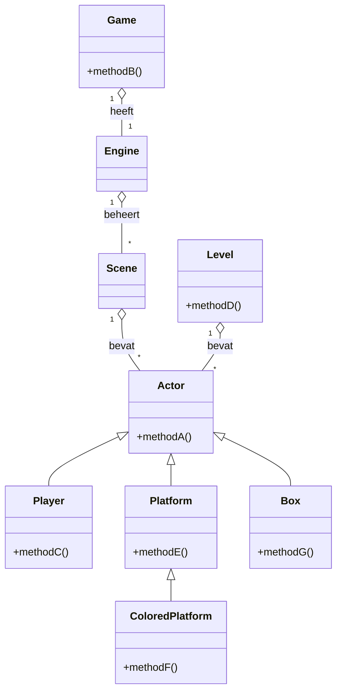

# Mermaid Diagram for Classes and Relationships
Download the Mermaid plugin from the VS Code marketplace to view this diagram. 
(in the workplace recomendations.)

//voorbeeld
Actor <|-- Player
    Actor <|-- C
    Player <|-- D
